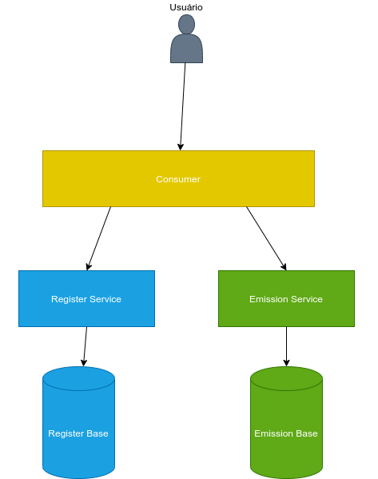

# Bases Legais - LGPD
## Arquitetura
<h1 align="center">
<br>
  
<br>
<br>
</h1>

## Testar localmente
Para testar localmente, basta subir os três projetos usando o seguinte comando:
```
mvn spring-boot:run
```